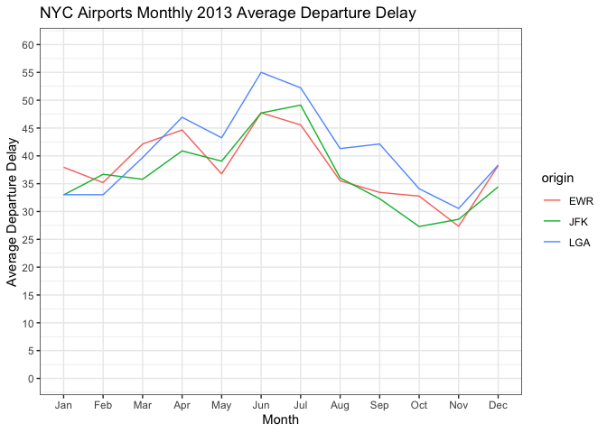
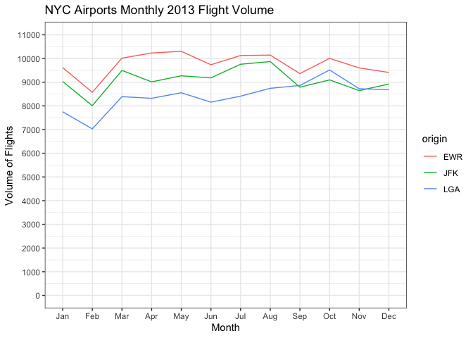
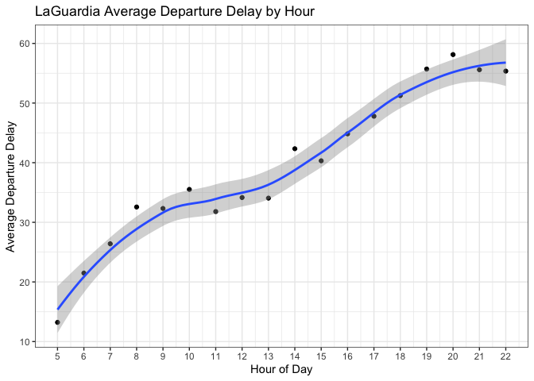
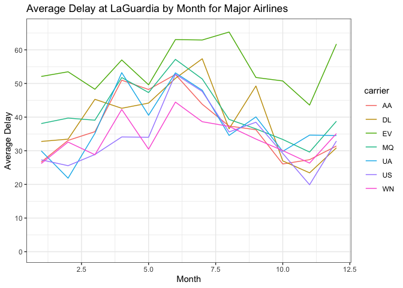
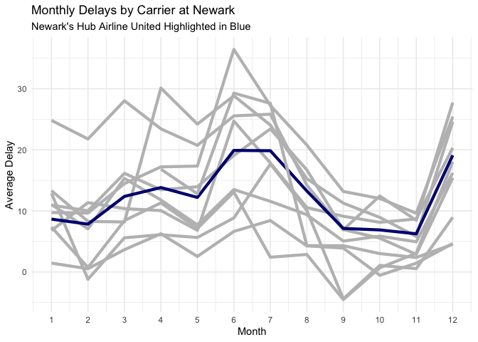

## Load Initial Datasets

Load the 5 datasets provided in nycflights13 package


```r
# Load datasets
airlines_data <- airlines
airports_data <- airports
flights_data <- flights
planes_data <- planes
weather_data <- weather
```

## Investigating Airport Departure Delay

First let's look at the three individual airports and how they compare for departure delay


```r
# Remove NA's in dataset as those are cancelled flights
flights_data <- na.omit(flights_data)

# Create indicator variable for volume
flights_data$n = 1

# Create dataset for each airport of average delay (when there is a delay) by month
flights_airport_data <- flights_data %>%
                        filter(dep_delay > 0) %>%
                        group_by(origin, month) %>%
                        summarise(avg_delay = mean(dep_delay))
```

```
## `summarise()` has grouped output by 'origin'. You can override using the `.groups` argument.
```

```r
# Replace month number with character for plot readability
flights_airport_data$month <- month.abb[flights_airport_data$month]

# Create lineplot showing average delay over 2013 for each airport
ggplot() + geom_line(aes(x = month, y = avg_delay, group = origin, color = origin), data = flights_airport_data) + 
  theme_bw() + 
  labs(x = "Month", y = "Average Departure Delay", title = "NYC Airports Monthly 2013 Average Departure Delay", legend.title = "Origin Airport") + 
  scale_x_discrete(limits = c("Jan","Feb","Mar","Apr","May","Jun","Jul","Aug","Sep","Oct","Nov","Dec")) + 
  scale_y_continuous(limits = c(0,60), breaks = c(0,5,10,15,20,25,30,35,40,45,50,55,60))
```

<!-- -->

This graph demonstrates the average monthly departure delay for the three arports in 2013. We can identify the trend of average delay increasing from winter through spring, having a maximum in the summer months, and then decreasing during the fall. While the airports follow the same trends with similar delays, it seems LaGuardia airport has the highest delay for most months.

## Airport Volume

An important factor to consider when looking at departure delay is the volume of flights for an airport.

```r
# Create dataset for volume of airport by month
flights_volume_data <- flights_data %>%
                       group_by(origin, month) %>%
                       summarise(volume = sum(n))
```

```
## `summarise()` has grouped output by 'origin'. You can override using the `.groups` argument.
```

```r
# Plot volume for each airport by month
ggplot() + geom_line(aes(x = month, y = volume, group = origin, color = origin), data = flights_volume_data) +
  theme_bw() +
  labs(x = "Month", y = "Volume of Flights", title = "NYC Airports Monthly 2013 Flight Volume") +
  scale_x_discrete(limits = c("Jan","Feb","Mar","Apr","May","Jun","Jul","Aug","Sep","Oct","Nov","Dec")) + 
  scale_y_continuous(limits = c(0,11000), breaks = c(0,1000,2000,3000,4000,5000,
                                                     6000,7000,8000,9000,10000,11000))
```

<!-- -->

The volume trends don't exactly mirror the flight delays: except for a slight decrease in february, there isn't too much of an increase during the summer months. 

## LaGuardia Airport

As LaGuardia airport had the lowest volume but on average the highest departure delay, let's investigate it first.


```r
# Filter to only LaGuardia Airport
flights_data_laguardia <- flights_data %>%
                          filter(origin == "LGA") %>%
                          filter(dep_delay > 0)

# Investigate relationship between delay and hour of day
flights_data_laguardia_month <- flights_data_laguardia %>%
                                group_by(hour) %>%
                                summarise(avg_delay = mean(dep_delay))

# Plot average departure delay by hour for LGA
ggplot() + geom_point(aes(x = hour, y = avg_delay), data = flights_data_laguardia_month) + 
  geom_smooth(aes(x = hour, y = avg_delay), data = flights_data_laguardia_month) +
  theme_bw() +
  scale_x_continuous(limits = c(5,22), breaks = c(5,6,7,8,9,10,11,12,13,14,15,16,17,18,19,20,21,22)) +
  labs(x = "Hour of Day", y = "Average Departure Delay", title = "LaGuardia Average Departure Delay by Hour")
```

```
## `geom_smooth()` using method = 'loess' and formula 'y ~ x'
```

<!-- -->

As the day progresses at LaGuardia, the average departure delay dramatically increases. Do airlines have any pattern within delay?

## LGA Departure Delay with Airline


```r
flights_data_laguardia_airline_major <- flights_data_laguardia %>%
                                        filter(carrier %in% c("UA","US","AA","DL","MQ","WN","EV")) %>%
                                        group_by(carrier, month) %>%
                                        summarise(avg_delay = mean(dep_delay),
                                        flight_volume = sum(n))
```

```
## `summarise()` has grouped output by 'carrier'. You can override using the `.groups` argument.
```

```r
# Bring in airline name
flights_data_laguardia_airline <- merge(x = flights_data_laguardia_airline_major, y = airlines_data, by = "carrier")
ggplot() + geom_line(aes(x = month, y = avg_delay, color = carrier), data = flights_data_laguardia_airline_major) + 
  theme_bw() + 
  scale_y_continuous(limits = c(0,66), breaks = c(0,10,20,30,40,50,60)) + 
  labs(x = "Month", y = "Average Delay", title = "Average Delay at LaGuardia by Month for Major Airlines") 
```

<!-- -->

Envoy Air, a regional subsidiary, has the highest average delay time throughout the entire year. As for other trends, there is mostly noise with the other airlines, and no real patterns emerge. Delays seems to overall be lowest in November, and highest in Spring/Summer.

## Are Old Planes And Delays Related?


```r
flights_airlines <- left_join(x = flights_data, y = planes_data, by = "tailnum")
flights_airlines <- na.omit(flights_airlines)

flights_airlines <- flights_airlines %>%
  mutate(is_delayed = ifelse(dep_delay > 1, 1, 0))

cor(flights_airlines$year.y, flights_airlines$is_delayed)
```

```
## [1] -0.03027858
```

Surprisingly... not at all. The correlation coefficient is essentially 0.

## United Airlines Delays at Newark

United Airlines is the only airline that has a hub at Newark Airport. Does their hub status affect their delays compared to the rest of the airlines?


```r
united_ewr <- na.omit(flights_data)
united_ewr <- united_ewr %>%
  filter(origin == "EWR") %>%
  group_by(carrier, month) %>%
  summarise(avg_delay = mean(dep_delay)) %>%
  mutate(united = ifelse(carrier == "UA", '1', '0')) %>%
  filter(carrier != "OO")
```

```
## `summarise()` has grouped output by 'carrier'. You can override using the `.groups` argument.
```

```r
ggplot(data = united_ewr) + 
  geom_line(aes(x = month, y = avg_delay, color = united, group = carrier), size = 1.5) + 
  scale_color_manual(values = c("grey", "navy blue")) + 
  theme_minimal() + 
  theme(legend.position = "none") + 
  labs(title = "Monthly Delays by Carrier at Newark",
       subtitle = "Newark's Hub Airline United Highlighted in Blue", 
       x = "Month",
       y = "Average Delay") + 
  scale_x_continuous(breaks = seq(1, 12, 1))
```

<!-- -->

United is actually about average for ever month relative to other airlines. 
